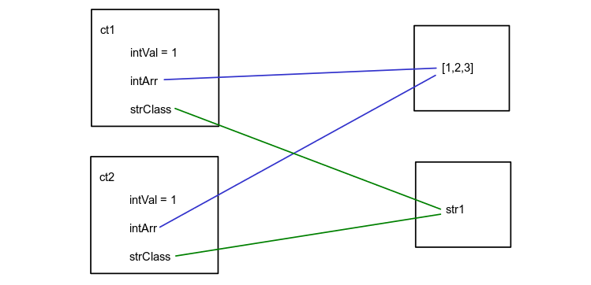
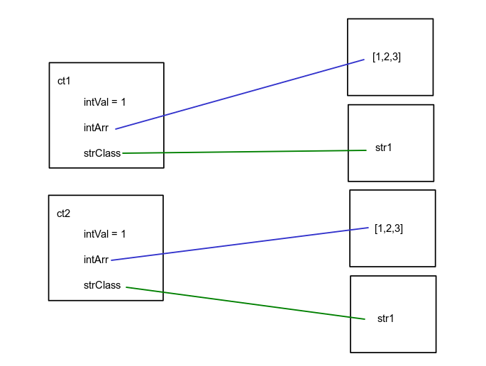

# Shallow Copy and Deep Copy

## Introduction
In object-oriented programming, object copying is creating a copy of an existing object. The result object is called object copy or simply copy. There are two main copy methods: Shallow Copy and Deep Copy.

## Value type and Reference type
A value-type variable contains an instance of the type. In C# value types include:
- simple types: bool, byte, char, decimal, double, float, int, long, sbyte, short, uint, ulong, ushort
- enum type
- structure type
- nullable value type

When passing a value-type variable from one method to another, the system will create a separate copy of the variable in another method. If the value of the variable got changed in one method, it won't affect the value in another method.
* Example 1: variable ```i``` remains unchanged even after we pass it to the ```DoubleTheValue()``` method and double its value.
```C#
public class Solution
{
    public int DoubleTheValue(int val)
    {
        return val * 2;
    }
    public static void Main(string[] args)
    {
        Solution sol = new Solution();
        int i = 2;
        int j = sol.DoubleTheValue(i);

        Console.WriteLine(i); // i = 2
        Console.WriteLine(j); // i = 4
    }
}
```
* Example 2: structure ```C``` remains unchanged even after we pass it to ```RedefineLanuage()``` method and change its fields' values.
```C#
public class Solution
{
    public struct Language
    {
        public string name;
        public bool IsOOP;

        public Language(string n, bool oop)
        {
            name = n;
            IsOOP = oop;
        }
    }

    public Language RedefineLanguage(Language language, string n, bool oop)
    {
        language.name = n;
        language.IsOOP = oop;
        return language;
    }
 
    public static void Main(string[] args)
    {
        Solution sol = new Solution();
        Language C = new Language("C", false);
        Language CPlusPlus = sol.RedefineLanguage(C, "C++", true);
        Console.WriteLine(string.Format("{0},{1}", C.name, C.IsOOP)); // C,false
    }
}
```

Unlike the value-type variables, a reference-type variable doesn't store the values directly. Instead, it stores an address where the value is stored. In other words, a reference-type variable contains a pointer to another memory location that holds the data. In C#, reference types include:
- String
- Array (even if its element are value types)
- Class
- Delegate

When passing a reference-type variable from one method to another, the system doesn't create a copy. Instead, the system passes the varaible's memory address. Hence, if the value got changed in one method, it will be reflected in another method.
* Example: If we define ```Language``` as a Class instead of a Structure, values of varaible ```C```'s field's will be changed.
```C#
public class Solution
{
    public class Language
    {
        public string name;
        public bool IsOOP;

        public Language(string n, bool oop)
        {
            name = n;
            IsOOP = oop;
        }
    }

    public Language RedefineLanguage(Language language, string n, bool oop)
    {
        language.name = n;
        language.IsOOP = oop;
        return language;
    }
 
    public static void Main(string[] args)
    {
        Solution sol = new Solution();
        Language C = new Language("C", false);
        Language CPlusPlus = sol.RedefineLanguage(C, "C++", true);
        Console.WriteLine(string.Format("{0},{1}", C.name, C.IsOOP)); // C++,true      
    }
}
```
## Shallow Copy
Shallow copy is a field by field copy. If the field is value type, then shallow copy copies the value. If the field is reference type, then shallow copy copies the reference instead of copying the object that the reference points to. So the original object and copied object are not 100% disjoint, which means any changes made to the copied object will be reflected in the original object and vice versa.




## Deep Copy
Deep Copy is a process of creating a new object and then copying the fields of the source object to the object copy. If the field is a value type, then deep copy copies the value. If the field is a reference type, then the copy will have different memory.



## Example
```C#
using System;

public class StringClass
{
    public string strVal;

    public StringClass(string str)
    {
        strVal = str;
    }
}

public class CopyTest
{
    public int intVal { get; set; }  // primitive type
    public int[] intArr { get; set; } // reference type
    public StringClass strClass { get; set; } // reference type

    public CopyTest ShallowCopy(CopyTest copyTest)
    {
        return (CopyTest)copyTest.MemberwiseClone();
    }

    public CopyTest DeepCopy(CopyTest copyTest)
    {
        CopyTest cp = (CopyTest)copyTest.MemberwiseClone();
        cp.strClass = new StringClass(copyTest.strClass.strVal);
        cp.intArr = new int[copyTest.intArr.Length];
        for (int i = 0; i < copyTest.intArr.Length; i++)
            cp.intArr[i] = copyTest.intArr[i];
        return cp;
    }

    public static void Main(string[] args)
    {
        CopyTest ct1 = new CopyTest();
        ct1.intVal = 1;
        ct1.intArr = new int[] { 1, 2, 3 };
        ct1.strClass = new StringClass("str1");

        // Shallow Copy
        CopyTest ct2 = ct1.DeepCopy(ct1);

        // Deep Copy
        // CopyTest ct2 = ct1.DeepCopy(ct1);
        
        Console.WriteLine("Orignal Data:");
        Console.WriteLine("ct1: " + ct1.intVal + ", " + ct1.intArr[0] + ", " + ct1.strClass.strVal);
        Console.WriteLine("ct2: " + ct2.intVal + ", " + ct2.intArr[0] + ", " + ct2.strClass.strVal);

        ct1.intVal = 2;
        ct1.intArr[0] = 4;
        ct1.strClass.strVal = "str2";
        Console.WriteLine("Updated Data:");
        Console.WriteLine("ct1: " + ct1.intVal + ", " + ct1.intArr[0] + ", " + ct1.strClass.strVal);
        Console.WriteLine("ct2: " + ct2.intVal + ", " + ct2.intArr[0] + ", " + ct2.strClass.strVal);
    }
}
```
### Shallow Copy Output
Orignal Data:</br>
ct1: 1, 1, str1</br>
ct2: 1, 1, str1</br>
Updated Data:</br>
ct1: 2, 4, str2</br>
ct2: 1, 4, str2</br>

### Deep Copy Output
Orignal Data:</br>
ct1: 1, 1, str1</br>
ct2: 1, 1, str1</br>
Updated Data:</br>
ct1: 2, 4, str2</br>
ct2: 1, 1, str1</br>
